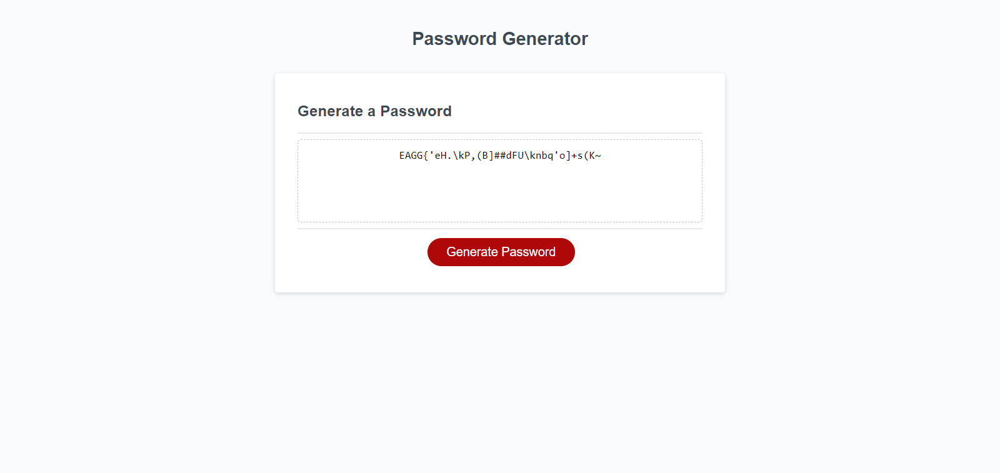

# Password_Generator

## Description
This is a random password generator with a simple and clear user experience.

## Usage
It doesn't require any installation. As a user you can just click on the "Generate Password" button and then you will be asked 5 questions about the length of the password and the character types (lowercase, uppercase, numeric and special characters). The password cannot be shorter than 10 character and longer than 64. In order to get the password generated you need to choose at least 1 character type to include in your password. If your input is invalid the questions will start from the beginning. Once you answered all the questions the password will be generated and displayed in the rectangle shaped box on the website and you can copy and paste it to somewhere else. If you resize the browser window you will be able to see the responsive layout of the website.
Please see the mockup image of the website below:

Here is the link for the deployed webpage: https://vighimre87.github.io/Password_Generator/

## Credits
N/A

## License
Plese refer to the LICENSE file in the repo.
